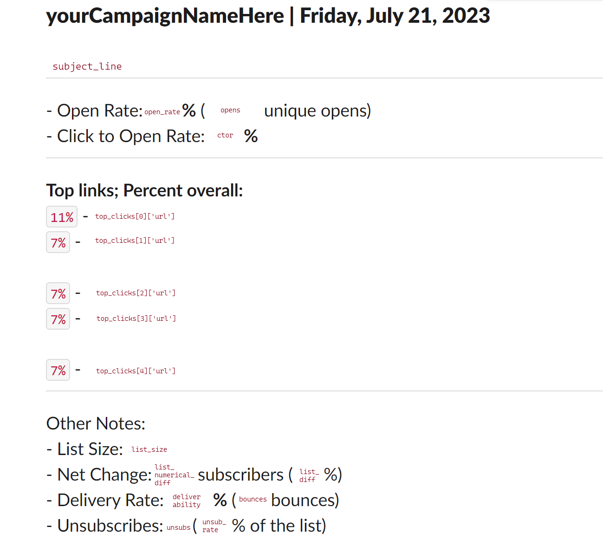
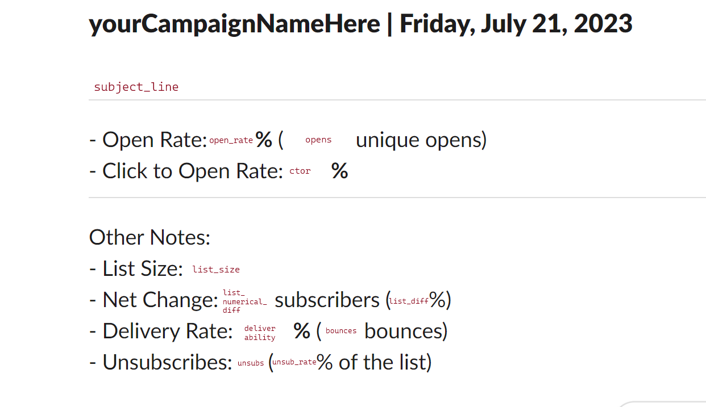

# mailchimp-bots
Bots that use the Mailchimp API to post newsletter metrics into Slack

## Table of Contents
[Ingredients](#ingredients) | [How it works](#how-it-works) | [Gathering Info](#gathering-info) | [Choose Your Bot](#choose-your-bot) | [AWS Bot Set-Up](#aws-bot-set-up) | [Local Development](#local-development) | [Resources](#resources)

## Ingredients 
This bot requires a basic knowledge of 
- [Python](https://wiki.python.org/moin/BeginnersGuide)
- [AWS Lambda](https://docs.aws.amazon.com/lambda/latest/dg/lambda-python.html)
- [Mailchimp's Marketing API](https://mailchimp.com/developer/api/marketing/)
- [Slack API](https://api.slack.com/messaging/webhooks)

It also requires:
- An AWS [Lambda](https://aws.amazon.com/lambda/) function (or similar service)
- [A Slack App](https://api.slack.com/apps?new_app=1)
- A Slack channel
- [A Mailchimp API Key](https://mailchimp.com/help/about-api-keys/)

It uses two Python libraries:
- [`mailchimp_marketing`](https://github.com/mailchimp/mailchimp-marketing-python)
- `requests`

<p align="right"><a href="#table-of-contents">Back to Top ↑</a></p>

## How it works
Triggered by a `cron` job in [AWS Eventbridge](https://aws.amazon.com/eventbridge/), a Lambda function queries the Mailchimp API to get metrics about a specified campaign. It returns the results of the query as a message to a specific channel in Slack.

<p align="right"><a href="#table-of-contents">Back to Top ↑</a></p>

## Gathering Info

To run of the Mailchimp Bots, you will need a Mailchimp API key, a folder or interest id and a Slack webhook. 

### Mailchimp API Key
<details>
<summary>Expand for detailed instructions on how to get a Mailchimp API key.</summary>

To get your Mailchimp API key, log into your Mailchimp account and open your profile. From the `Extras` section of the navigation, select `API Keys`.  Once a key has been created, it is not possible to gather its details again, so you will need to generate a new one.

Under the list of pre-existing keys, click `Create a Key`. Add a name under `API Key Name` and click `Generate Key`.

Only click `Done` once you have saved the API key details; **keys can only be viewed directly after generation**.

</details>

Save the key into your [env file for local development](#local-development) or as an [environmental variable if you are setting up AWS](#aws-bot-set-up).

>Note: The bots access the Mailchimp API key using two pieces: the key and the server. Separated by a hyphen, the server is usually the second, shorter section of the string provided by Mailchimp. 


### Folder ID
Folders are the most reliable method currently supported by the bots to filter for campaigns. 

To find your folder ids, add the Mailchimp API keys to a local terminal or command line as environmental variables.
```
## Windows
$ENV:MAILCHIMP_KEY='abc....123'
$ENV:MAILCHIMP_SERVER='usXX'

## Linux / Mac
export MAILCHIMP_KEY='abc....123'
export MAILCHIMP_SERVER='usXX'
```
Run the `get_info.py` script in the `data_samples` folder. The script generates three JSON files. Open `folders.json` and find the folder your campaigns are saved in. If you have more than 50 folders, you may need to raise the count, or use `offset` until you find the correct id. 

_Example Data_
```
{
    "name": "Example Folder Name",
    "id": "XYZ123abc",
    "count": ##
}
```
Save the folder ID or interest ID (see below) into your env file for local development or as an environmental variable if you are setting up AWS. 

### Interest ID
Although folder IDs are the most reliable method supported by these bots, another fairly reliable method is interest IDs, visible in the Mailchimp application as `Group Names`. 

<details>
<summary>Expand for detailed instructions on how to get an interest id.</summary>

Before you find the interest ids, it’s important to find the group names in the Mailchimp application.

After logging into Mailchimp, go to your audience dashboard and select `Manage audience`, then `Manage contacts`. Make sure that the current audience is correct, then click `Groups` (interest categories in the Mailchimp API), and expand the relevant group. Underneath, you should see the group names. These are your interest IDs.

To pull them out of the API, we will follow a similar path. 

Add the Mailchimp API keys as environmental variables.
```
## Windows
$ENV:MAILCHIMP_KEY='abc...123'
$ENV:MAILCHIMP_SERVER='usXX'

## Linux / Mac
export MAILCHIMP_KEY='abc...123'
export MAILCHIMP_SERVER='usXX'
```
Then, run the `get_info.py` script in the `data_samples` folder. This will generate three JSON files. Open `audience_list.json` and find the correct id for the audience.  Add the id as an environmental variable and run `get_info.py` again. 
```
## Windows
$ENV:LIST_ID='abc...123'

## Linux / Mac
export LIST_ID='abc...123'
```
This will generate a new file, `interest_categories.json`. Open it and find the correct group. Save the id as an environmental variable.

```
## Windows
$ENV:INTEREST_CAT_ID='abc....123'

## Linux / Mac
export INTEREST_CAT_ID='abc...123'
```

Run `get_info.py` one last time. `interests.json` should appear and contain the relevant interest IDs. 

Save the interest ID into your env file for local development or as an environmental variable if you are setting up AWS. 
</details>

### Slack Webhook
These bots use a simple webhook to send data into a specific channel. They are not interactive. 

To set this up, go to [Your Apps](https://api.slack.com/apps) and click `Create New App`. In the resulting pop-up window, select `From a manifest`. Choose a workspace to develop the app in and hit `Next`. Delete everything in the text box under the `JSON` tab. Copy the code in `manifest.json` and paste it in. Click `Next` and then `Create`. 

From the sidebar that appears select `Incoming Webhooks` then scroll down until you see `Add New Webhook to Workspace`. Click that button, select the channel you want the metrics or test messages to go into, then click `Allow`.

Save the `Webhook URL` into your env file for local development or as an environmental variable if you are setting up AWS. 

<p align="right"><a href="#table-of-contents">Back to Top ↑</a></p>

## Choose Your Bot

| Daily | Weekly |
| ----- | -------|
| The Daily Bot was created to report on a daily newsletter. Run Tuesday through Saturday, it sent metrics to Slack ~24 hours after the campaign was sent. | The Weekly Bot was created to report on a newsletter that was sent once a week. The bot ran once a week, sending metrics to Slack ~3 days after the campaign was sent. |
|  | |


### Notes on the Daily Bot:
- The bot provides a comparison between the selected campaign and the previous one. Since the newsletter was only sent on weekdays, if the selected campaign was sent on a Monday, the Friday campaign was used as the comparison. 
- Since this bot uses a folder ID to filter the campaigns, and only one newsletter was sent per day, the time range was expansive.
- While the top clicked links are highlighted in the Slack message, they were also filtered to exclude links that recieved copious amounts of bot traffic. 

### Notes on the Weekly Bot:
- The bot provides a comparison between the selected campaign and the previous one.
- Since this bot uses a folder ID to filter the campaigns, and only one newsletter was sent per day, the time range was expansive.

<p align="right"><a href="#table-of-contents">Back to Top ↑</a></p>

## AWS Bot Set-up 

### Create a Lambda Layer
Two of the libraries used by the bots, `requests` and `mailchimp_marketing`, are not included in the console and must be added separately. Due to zip size limitations at the time, we opted to use a Lambda layer. We have continued the practice due to the simplicity of adding these libraries to multiple bots. 
- After installing this repository locally, run `pip install --target lambda_layer/python requests` and `pip install --target lambda_layer/python mailchimp_marketing`. This will create a new folder, `lambda_layer`, with a nested `python` folder. 
-  Navigate into the `lambda_layer` folder and zip the python folder and its contents. Save as `lambda_layer.zip`. 
- Log in to AWS and navigate to Lambda. 
- Choose `Layers` from the sidebar and click `Create layer`.
- Give the layer a name, upload the `lambda_layer.zip` and click `Create`. 
- Note the `ARN`; it will be used to connect the layer to our function.
#### Note: Lambda layers can be updated from the commandline
```
# Windows Powershell (From lambda_layer folder)

### Create the layer zip OR
Compress-Archive ./python ./lambda_layer.zip 

### Update the layer zip
Compress-Archive ./python -Update ./lambda_layer.zip

### Push the layer to AWS
$ aws lambda publish-layer-version --layer-name yourLayerName --zip-file fileb://lambda_layer.zip --profile yourProfileName
```

### Create a Lambda Function
- Log in to AWS and navigate to Lambda. 
- Choose `Functions` and click `Create function`.
- Give the function a name and choose a version of Python for it to run and click `Create`. We used Python 3.10.
- To add the code, either copy-paste it from a `lambda_function.py` file into the editor, or zip the file and upload it using the `Upload from` option. 

### Configure the Function
- After adding the code, scroll down to `Layers` and click `Add a layer`. 
  - Select `Specify an ARN` and enter the `ARN` from the layer created above. 
  - Click `Verify` then `Add`. 
- Finally, click `Configuration` and select `Environmental Variables`. Click `Edit` to add the following:
    - FOLDER_ID (the folder id of the ongoing campaign you wish to track)
    - MAILCHIMP_KEY
    - MAILCHIMP_SERVER
    - SLACK_WEBHOOK (the webhook provide by your app, allowing you to post in your designated channel)
- Click `Save`.

### Add an EventBridge Trigger
- On the same page, click `Add trigger`. 
- Choose `Eventbridge` and `Create a new rule`. 
- Give the rule a name, confirm `Schedule expression` is selected and enter a cron expression (e.g. `cron(0 17 ? * MON-FRI *)`) and click `Add`.

<p align="right"><a href="#table-of-contents">Back to Top ↑</a></p>

## Local Development
Although you can plug and play with these bots, you can also adjust them. The `local_development` folder contains copies of the Daily and Weekly bot that can be run directly from the terminal or command line on your computer, allowing you the freedom to make changes and immediately test them. We recommend creating a separate Slack workspace or test channel where   you can send as many tests as you need to customize the bot to your use case. 

`local_development` also contains a sample bot, `interest_id_filter.py`, that filters the campaigns using interest ids instead of folders ids.

### Running a Local Bot 
Set the following environmental variables in the command line (e.g. `$ENV:MAILCHIMP_KEY='abc...123`). 

| Daily | Weekly | Interest Ids |
| ----- | ------ | ------------ |
| MAILCHIMP_KEY | MAILCHIMP_KEY | MAILCHIMP_KEY |
| MAILCHIMP_SERVER | MAILCHIMP_SERVER | MAILCHIMP_SERVER | 
| FOLDER_ID | FOLDER_ID | INTEREST_ID |
| SLACK_WEBHOOK | SLACK_WEBHOOK | SLACK_WEBHOOK |

Navigate into `mailchimp-bots` or `local_development` and run the local bot script with python (example: from `mailchimp-bots` run `py local_development/interest_id_filter.py`). 

A message should appear in your test Slack/Slack channel. If you aren't seeing any campaigns, consider changing the starting date of the time range.  

>Note: The structure of the code local bots is slightly different than in a `lambda_function.py`. Please use caution when moving changes from a local bot to a lambda function.

<p align="right"><a href="#table-of-contents">Back to Top ↑</a></p>

## Resources:
- [About API Keys | Mailchimp](https://mailchimp.com/help/about-api-keys/)
- [Organize Campaigns into Folders | Mailchimp](https://mailchimp.com/help/organize-campaigns-into-folders/)
- [Getting Started with Groups | Mailchimp](https://mailchimp.com/help/getting-started-with-groups/)
- [Lists/Audiences > Interests | Mailchimp Marketing API Reference | Mailchimp Developer](https://mailchimp.com/developer/marketing/api/interests/)
- [Introduction to Slack apps | Slack](https://api.slack.com/docs/apps)
- [Update functions from the console](https://docs.aws.amazon.com/lambda/latest/dg/python-package.html#python-package-dependencies)
  - Checkout `example_aws_command_line_updates` for some examples of updating the a Lambda function from the command line. 
- [Lambda Layers](https://docs.aws.amazon.com/lambda/latest/dg/chapter-layers.html)
- [Triggers with Eventbridge](https://docs.aws.amazon.com/eventbridge/latest/userguide/eb-create-rule-schedule.html)

<p align="right"><a href="#table-of-contents">Back to Top ↑</a></p>

